# MySkanilan Portal System — Comprehensive Architecture, Flow, and Central Data Specification

> **Dokumen Spesifikasi Desain Sistem & Integrasi Portal Digital Terpadu SMKN 9 Semarang**  
> *Dikembangkan untuk Lomba JHIC & Standar Operasional Ekosistem Digital Berkelanjutan*

---

## Daftar Isi

1. [Executive Summary & Visi Portal](#1-executive-summary--visi-portal)
2. [Konsep Central Data Platform & Document Database](#2-konsep-central-data-platform--document-database)
3. [Arsitektur Sistem Terintegrasi](#3-arsitektur-sistem-terintegrasi)
4. [Matriks Peran (Role) & Hak Akses Portal](#4-matriks-peran-role--hak-akses-portal)
5. [Comprehensive User Journeys & Detailed Flowcharts](#5-comprehensive-user-journeys--detailed-flowcharts)
   - [5.1 Alur Registrasi Siswa & Provisioning RFID](#51-alur-registrasi-siswa--provisioning-rfid)
   - [5.2 Alur Transaksi Finansial Tertutup (Bank Sekolah & POS Kantin)](#52-alur-transaksi-finansial-tertutup-bank-sekolah--pos-kantin)
   - [5.3 Alur Integrasi Presensi RFID ke LMS & Notifikasi Ortu](#53-alur-integrasi-presensi-rfid-ke-lms--notifikasi-ortu)
   - [5.4 Alur Marketplace Multijurusan & Sinkronisasi Unit Produksi](#54-alur-marketplace-multijurusan--sinkronisasi-unit-produksi)
   - [5.5 Alur Sinkronisasi & Integrasi Aplikasi Baru (Open API & Webhook)](#55-alur-sinkronisasi--integrasi-aplikasi-baru-open-api--webhook)
   - [5.6 Alur AI Chatbot Knowledge Base & Context Aggregator](#56-alur-ai-chatbot-knowledge-base--context-aggregator)
   - [5.7 Alur Dual-Control Otorisasi Top-Up Saldo Besar (> Rp 500.000)](#57-alur-dual-control-otorisasi-top-up-saldo-besar--rp-500000)
   - [5.8 Alur Pembatalan & Refund Transaksi POS Kantin](#58-alur-pembatalan--refund-transaksi-pos-kantin)
   - [5.9 Alur Settlement Harian & Rekonsiliasi Otomatis (Zero-Fee Clearing)](#59-alur-settlement-harian--rekonsiliasi-otomatis-zero-fee-clearing)
   - [5.10 Alur Siklus Hidup Kartu RFID (Hilang, Freeze, & Penggantian Kartu)](#510-alur-siklus-hidup-kartu-rfid-hilang-freeze--penggantian-kartu)
   - [5.11 Alur Kontrol Pengeluaran Orang Tua & Deteksi Anomali (Velocity Check)](#511-alur-kontrol-pengeluaran-orang-tua--deteksi-anomali-velocity-check)
6. [Spesifikasi Skema Document Database (MongoDB)](#6-spesifikasi-skema-document-database-mongodb)
   - [6.1 Koleksi users (Master Data Warga Sekolah)](#61-koleksi-users-master-data-warga-sekolah)
   - [6.2 Koleksi wallets (Buku Kas Saldo Digital)](#62-koleksi-wallets-buku-kas-saldo-digital)
   - [6.3 Koleksi transactions (Immutable Financial Ledger)](#63-koleksi-transactions-immutable-financial-ledger)
   - [6.4 Koleksi products (Marketplace Multijurusan Polimorfik)](#64-koleksi-products-marketplace-multijurusan-polimorfik)
   - [6.5 Koleksi connected_apps (Pendaftaran Aplikasi Eksternal)](#65-koleksi-connected_apps-pendaftaran-aplikasi-eksternal)
   - [6.6 Koleksi rfid_cards (Lifecycle Kartu Fisik & Enkripsi)](#66-koleksi-rfid_cards-lifecycle-kartu-fisik--enkripsi)
   - [6.7 Koleksi merchants (Profil & Akun Penampung Kantin/Koperasi)](#67-koleksi-merchants-profil--akun-penampung-kantinkoperasi)
   - [6.8 Koleksi settlements & reconciliations (Buku Tutup Harian & Audit Anomali)](#68-koleksi-settlements--reconciliations-buku-tutup-harian--audit-anomali)
7. [Kontrak API Gateway & Protokol Integrasi](#7-kontrak-api-gateway--protokol-integrasi)
8. [Desain Arsitektur Antarmuka (Frontend Portal SPA)](#8-desain-arsitektur-antarmuka-frontend-portal-spa)
   - [8.1 Struktur Modul & Feature-Sliced Architecture](#81-struktur-modul--feature-sliced-architecture)
   - [8.2 Wireframe & Spesifikasi Layar Kunci Portal](#82-wireframe--spesifikasi-layar-kunci-portal)
   - [8.3 Design Tokens, Palet Warna & Audio-Visual Sensory Feedback](#83-design-tokens-palet-warna--audio-visual-sensory-feedback)
9. [Protokol Keamanan, Validasi & Audit Trail](#9-protokol-keamanan-validasi--audit-trail)
   - [9.1 Standar Hardware RFID & Klarifikasi UID 7-Byte](#91-standar-hardware-rfid--klarifikasi-uid-7-byte)
   - [9.2 Kebijakan Kriptografi & Siklus Hidup Token OAuth2](#92-kebijakan-kriptografi--siklus-hidup-token-oauth2)
   - [9.3 Mesin Deteksi Kecurangan (Velocity Check & Device Integrity)](#93-mesin-deteksi-kecurangan-velocity-check--device-integrity)
   - [9.4 Kepatuhan Regulasi Nasional & Landasan Yuridis](#94-kepatuhan-regulasi-nasional--landasan-yuridis)
10. [Rencana Implementasi & Prototype Roadmap](#10-rencana-implementasi--prototype-roadmap)

---

## 1. Executive Summary & Visi Portal

**MySkanilan Portal** dirancang bukan sekadar sebagai landing page informasi sekolah, melainkan sebagai **Central Digital Operating System** bagi seluruh warga SMKN 9 Semarang. Portal ini bertindak sebagai pintu gerbang (*Single Gate*) dan orkestrator yang mengintegrasikan 7 pilar layanan sekolah:

```
                          ┌───────────────────────────┐
                          │   MYSKANILAN WEB PORTAL   │
                          │   (Unified Entry Point)   │
                          └─────────────┬─────────────┘
                                        │
    ┌──────────────┬──────────────┬─────┴────────┬──────────────┬──────────────┐
    ▼              ▼              ▼              ▼              ▼              ▼
[Marketplace] [ThalassemiaGo] [Skanilan Tech]  [LMS]     [AI Assistant] [Perpus Online]
    │              │              │              │              │              │
    └──────────────┴──────────────┴──────┬───────┴──────────────┴──────────────┘
                                         ▼
                     ┌───────────────────────────────────────┐
                     │   BANK SEKOLAH & CASHLESS RFID HUB    │
                     └───────────────────┬───────────────────┘
                                         ▼
                     ┌───────────────────────────────────────┐
                     │     CENTRAL DOCUMENT DATA PLATFORM    │
                     │  (Single Source of Truth Warga SMKN)  │
                     └───────────────────────────────────────┘
```

### Nilai Strategis Utama:
1. **Satu Identitas Warga (Single Identity)**: Siswa, guru, wali murid, dan staf memiliki satu profil terpusat yang sinkron di semua subsistem.
2. **Ekonomi Sirkular Tertutup (Closed-Loop Economy)**: Seluruh transaksi keuangan digital menggunakan ledger internal yang aman, nol potongan pihak ketiga (*zero merchant fee*), dan 100% data transaksi dimiliki oleh sekolah.
3. **Pondasi Data Terbuka untuk Masa Depan (Future-Proof Integrations)**: Arsitektur data fleksibel berbasis dokumen yang siap menerima integrasi aplikasi baru kapan saja melalui Open API dan Webhook Event-Driven Architecture.

---

## 2. Konsep Central Data Platform & Document Database

### 2.1 Mengapa Membutuhkan Document Database (MongoDB) sebagai Central Data?

Pada arsitektur sekolah konvensional berbasis RDBMS (Relational DBMS) murni, data terpecah ke dalam tabel-tabel kaku. Ketika sekolah ingin menambahkan modul baru (misalnya portofolio siswa kejuruan, rekam donor darah, atau aplikasi IoT baru), migrasi skema tabel menjadi lambat dan berisiko tinggi.

Dengan menempatkan **MongoDB** sebagai **Central Data Hub**:
1. **Skema Fleksibel Polimorfik**: Produk SMK bervariasi luas (makanan tata boga memiliki masa kedaluwarsa & nutrisi; busana memiliki ukuran/warna; produk IoT memiliki spesifikasi tegangan & firmware). MongoDB menyimpan atribut dinamis tanpa perlu tabel relasi *Entity-Attribute-Value (EAV)* yang lambat.
2. **Complete Student Profile (Document-Oriented Aggregation)**: Seluruh data siswa (biodata, riwayat presensi RFID, portofolio karya, saldo dompet, rekam medis donor ThalassemiaGo, buku pinjaman) dapat diakses dan di-cache dalam satu agregasi dokumen terpadu.
3. **Event & Audit Log Append-Only**: Log transaksi keuangan, jejak audit keamanan, dan telemetry RFID disimpan dalam bentuk log berbasis waktu (*time-series document*) yang tidak bisa dimanipulasi (*immutable*).
4. **Kesiapan Integrasi Aplikasi Baru**: Aplikasi masa depan (seperti aplikasi mobile wali murid atau portal pengawas industri) hanya butuh kontrak JSON tanpa perlu menyentuh struktur tabel database internal.

### 2.2 Persyaratan Teknis MongoDB untuk Transaksi Finansial

> **⚠️ PENTING**: MongoDB multi-document transactions **wajib** menggunakan **Replica Set** (minimal 1-node RS untuk development, 3-node untuk production). Tanpa replica set, operasi atomik hanya berlaku per-dokumen tunggal.

**Strategi Transaksi Keuangan di MongoDB:**

| Operasi | Strategi | Keterangan |
|---|---|---|
| Update saldo (debit/credit) | `$inc` atomic operator | Satu operasi per dokumen — tidak butuh multi-doc transaction |
| Transfer antar wallet | Multi-document transaction session | Butuh replica set — debit source + credit destination + insert log |
| Balance check + deduct | `findOneAndUpdate` dengan filter `balance >= amount` | Optimistic concurrency — gagal otomatis jika saldo tidak cukup |
| Idempotency check | Unique index pada `nonce` | MongoDB reject duplikat di level database |

**Setup Replica Set Development (Minimal):**
```bash
# Jalankan MongoDB sebagai single-node replica set
mongod --replSet rs0 --bind_ip localhost
# Inisialisasi replica set
mongosh --eval "rs.initiate()"
```

**Contoh Atomic Balance Deduct (tanpa multi-doc transaction):**
```javascript
// Ini lebih performant daripada multi-doc transaction untuk operasi sederhana
db.wallets.findOneAndUpdate(
  { user_id: ObjectId("..."), balance: { $gte: 15000 }, status: "active" },
  { $inc: { balance: -15000, "daily_limit.spent_today": 15000 } },
  { returnDocument: "after" }
)
// Jika saldo < 15000 atau status bukan active → return null → tolak transaksi
```

> **Catatan**: Untuk operasi yang melibatkan lebih dari 1 koleksi (misal: transfer saldo antar wallet + insert transaction log), gunakan MongoDB Transaction Session. Pastikan Redis tetap digunakan untuk nonce store karena TTL lookup di Redis jauh lebih cepat (~0.1ms) dibanding MongoDB (~2-5ms).


## 3. Arsitektur Sistem Terintegrasi

Arsitektur Portal MySkanilan menggunakan pola **Modular Monolith Gateway with Central Document Data Store**:

```
┌────────────────────────────────────────────────────────────────────────────────────────┐
│                                 PRESENTATION TIER                                      │
│  React 19 SPA · Vite · TanStack Query · Tailwind CSS · Shadcn UI                       │
│  ┌───────────────────────┬───────────────────────┬──────────────────────────────────┐  │
│  │     Portal Publik     │   Dashboard Warga     │       Kasir POS & RFID           │  │
│  │ (Landing, Berita,     │ (Siswa, Guru, Ortu,   │   (Kantin, Koperasi, Unit Prod,  │  │
│  │  Katalog, Donor Darah)│  LMS, Dompet, Nilai)  │    Topup Counter Bank Sekolah)   │  │
│  └───────────────────────┴───────────────────────┴──────────────────────────────────┘  │
└───────────────────────────────────────────┬────────────────────────────────────────────┘
                                            │ HTTPS (TLS 1.3) / JSON:API / WSS
┌───────────────────────────────────────────▼────────────────────────────────────────────┐
│                             API GATEWAY & ORCHESTRATION LAYER                          │
│  Laravel 13 API Core · Laravel Passport (OAuth2 SSO) · Reverb (Real-time WebSocket)    │
│  ┌──────────────────────────────────────────────────────────────────────────────────┐  │
│  │ Middleware: DeviceAuth (HMAC) · RateLimiter · ScopeGuard · AuditLogger           │  │
│  └──────────────────────────────────────────────────────────────────────────────────┘  │
│  ┌──────────────────────────────────────────────────────────────────────────────────┐  │
│  │ Core Modules (Laravel Modules):                                                  │  │
│  │ [Core/Auth]     [BankSekolah]      [CashlessRFID]    [Marketplace]               │  │
│  │ [SkanilanTech]  [LMSModule]        [LibraryModule]   [ChatbotAI]                 │  │
│  │ [Thalassemia]   [IntegrationHub]   [EventDispatcher]                             │  │
│  └──────────────────────────────────────────────────────────────────────────────────┘  │
└───────────────────────┬───────────────────────────────────────┬────────────────────────┘
                        │                                       │
┌───────────────────────▼────────────────┐    ┌─────────────────▼────────────────────────┐
│     PRIMARY CENTRAL DATA PLATFORM      │    │             FAST-CACHE & BUS             │
│  MongoDB (Document Store)              │    │  Redis 7+                                │
│  - Master Siswa & User Documents       │    │  - Nonce Store (Anti-Replay Transaksi)   │
│  - Wallets & Immutable Ledgers         │    │  - Session & OAuth Tokens Cache          │
│  - Flexible Marketplace Catalog        │    │  - Queue Backend (Laravel Horizon)       │
│  - Knowledge Base (RAG Chunks)         │    │  - Rate Limiting Counters                │
│  - Audit Trail & RFID Raw Logs         │    └──────────────────────────────────────────┘
└────────────────────────────────────────┘
                                                  ▲
                                      ┌───────────┴───────────┐
                                      │   External Services   │
                                      │  RS Kariadi (webhook) │
                                      │  SMTP (notifikasi)    │
                                      │  Google Gemini AI     │
                                      │  S3-compatible (prod) │
                                      └───────────────────────┘
                                                  ▲
                                      ┌───────────┴───────────┐
                                      │    RFID Device Layer   │
                                      │  Kelas · Kantin · POS  │
                                      │  (device token + HMAC) │
                                      └───────────────────────┘
```

---

## 4. Matriks Peran (Role) & Hak Akses Portal

Sistem Portal membagi otorisasi menjadi 9 tingkatan hierarkis yang dikontrol melalui Token Scopes dan RBAC:

| Role Code | Nama Peran | Hak Akses Fitur di Portal | Batas Kewenangan Finansial |
|---|---|---|---|
| `super_admin` | Kepala IT / Administrator Utama | Akses penuh ke konfigurasi sistem, API key aplikasi luar, user management, dan audit logs. | Dapat melakukan settlement & emergency unfreeze kartu. |
| `admin` | Administrator Sekolah | Semua fitur non-keuangan, dashboard statistik, manajemen berita & konten portal. | Read-only laporan keuangan, tanpa akses operasional Bank Sekolah. |
| `bank_operator` | Petugas Bank Sekolah / Guru Keuangan | Portal teller Bank Sekolah, validasi setoran tunai, penerbitan & penggantian kartu RFID siswa. | Input Top-up tunai (approval ganda jika > Rp 500.000), cetak mutasi rekening. |
| `kasir_kantin` | Kasir Kantin / Koperasi Sekolah | Antarmuka Kasir POS, pemindaian RFID pembayaran, pembuatan invoice barang. | Menerima pembayaran tap RFID, melihat rekap omset harian kantin. Tidak bisa top-up. |
| `guru` | Tenaga Pendidik / Wali Kelas | Akses LMS (kelola materi/nilai), absensi kelas via RFID, monitoring status siswa binaan. | Read-only informasi umum, tanpa akses finansial siswa. |
| `siswa` | Siswa / Anggota Sekolah | Dashboard profil, akses LMS, pinjam perpustakaan, buka toko marketplace, cek saldo & limit dompet. | Melakukan pembayaran via RFID, belanja di marketplace siswa. Tidak bisa overdrawn. |
| `orang_tua` | Wali Murid / Orang Tua Siswa | Portal pantau siswa: melihat presensi jam hadir, nilai LMS, serta mutasi belanja harian anak. | Mengatur plafon limit pengeluaran harian kartu anak, menerima push notifikasi transaksi. |
| `unit_produksi` | Ketua Jurusan / PIC Skanilan Tech *(role tambahan — belum ada di README, perlu disinkronkan)* | Kelola inventaris alat & produk kejuruan, sinkronisasi stok unit produksi ke marketplace. | Menerima hasil bagi hasil penjualan unit produksi ke wallet unit. |
| `tamu` | Masyarakat / Calon Siswa / Industri | Halaman depan publik, profil sekolah, katalog produk siswa, form pendaftaran donor darah ThalassemiaGo. | Read-only publik. |

---

## 5. Comprehensive User Journeys & Detailed Flowcharts

### 5.1 Alur Registrasi Siswa & Provisioning RFID

Proses awal pemberian identitas digital kepada siswa baru dan pengikatan UID kartu fisik ke akun terpusat.

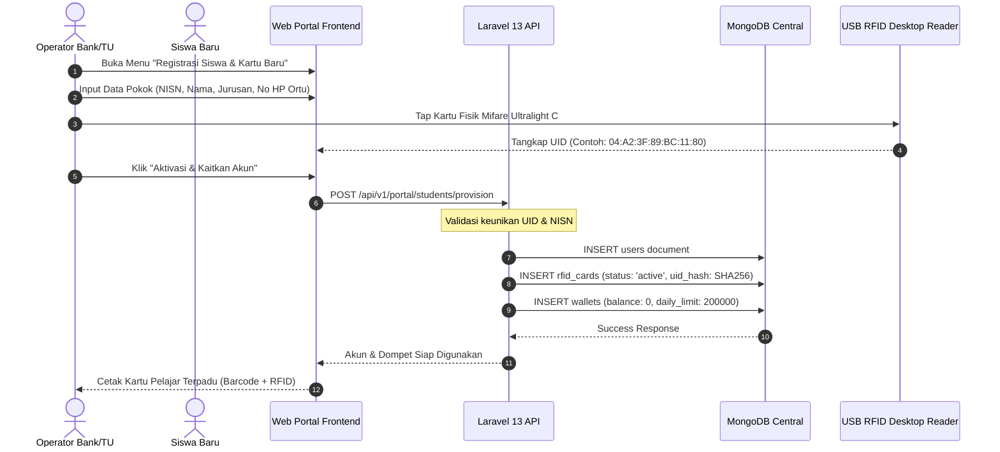

---

### 5.2 Alur Transaksi Finansial Tertutup (Bank Sekolah & POS Kantin)

Alur pembayaran saat siswa jajan di kantin menggunakan kartu RFID dengan verifikasi integritas kriptografis dan anti-replay.

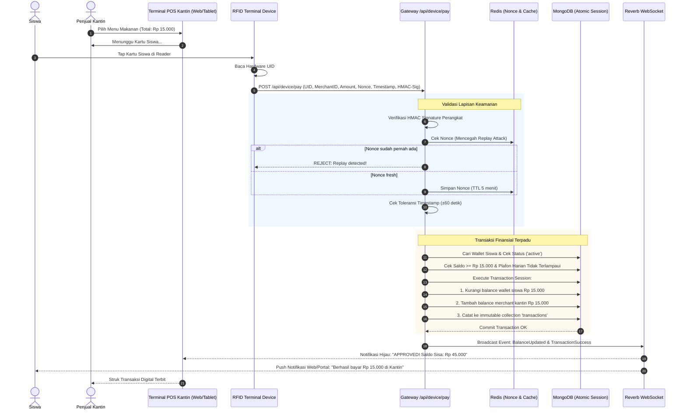

---

### 5.3 Alur Integrasi Presensi RFID ke LMS & Notifikasi Ortu

Menggambarkan bagaimana sekali tap kartu di pintu gerbang/kelas langsung memperbarui data di seluruh platform:

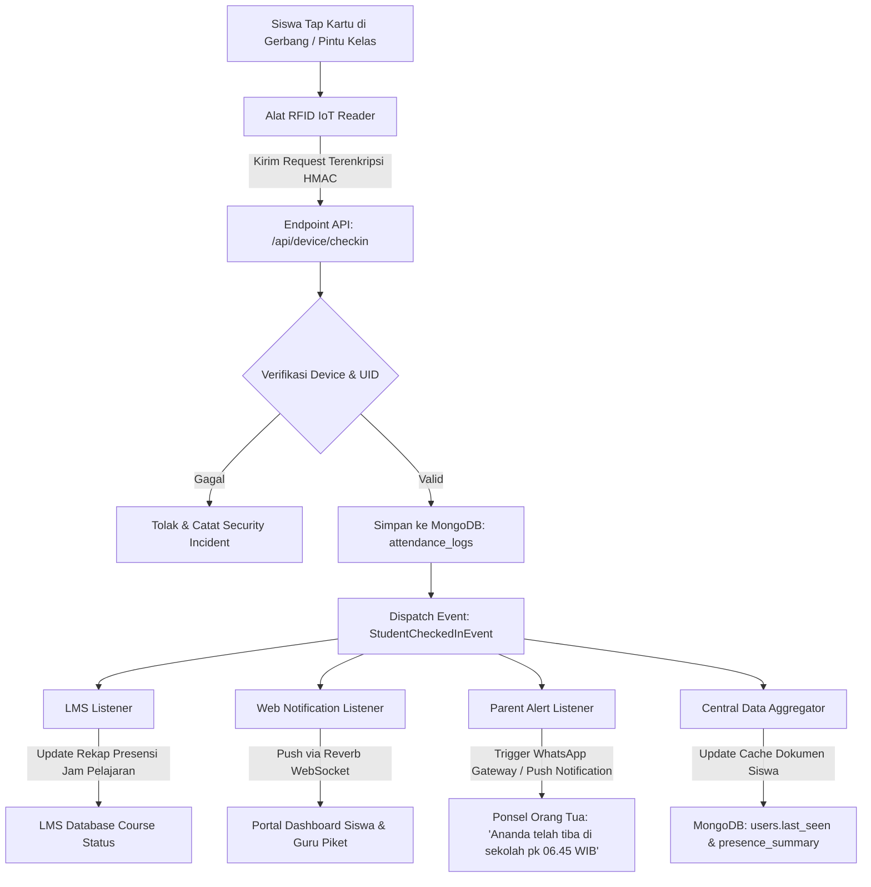

---

### 5.4 Alur Marketplace Multijurusan & Sinkronisasi Unit Produksi

Menghubungkan unit produksi nyata di bengkel/jurusan siswa dengan etalase marketplace portal sekolah:

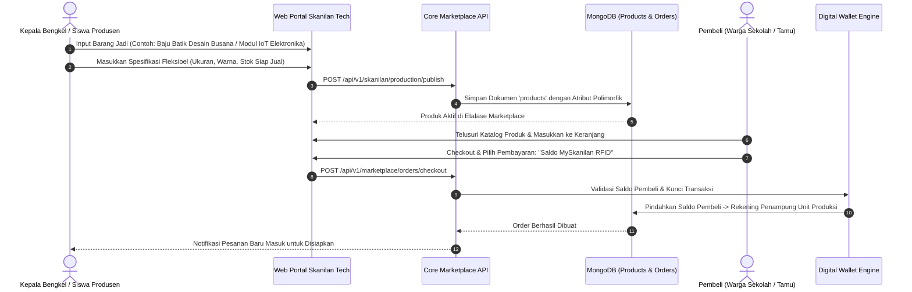

---

### 5.5 Alur Sinkronisasi & Integrasi Aplikasi Baru (Open API & Webhook)

Bagaimana aplikasi baru di masa depan (contoh: **Aplikasi Mobile Android Ortu**, **Kios Mandiri Perpus**, atau **Sistem Parkir Otomatis**) terhubung secara aman tanpa mengganggu sistem inti:

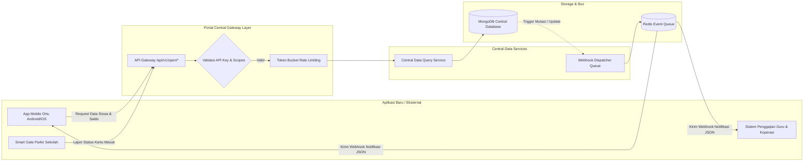

---

### 5.6 Alur AI Chatbot Knowledge Base & Context Aggregator

Chatbot cerdas portal yang terhubung langsung ke data aktual sekolah dengan mekanisme RAG (Retrieval-Augmented Generation):

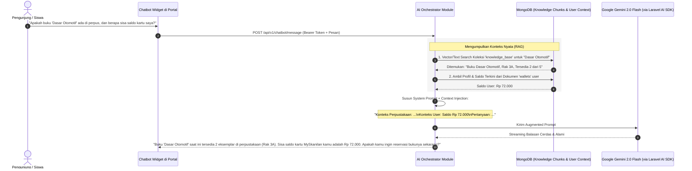

---

### 5.7 Alur Dual-Control Otorisasi Top-Up Saldo Besar (> Rp 500.000)

Sesuai standar kepatuhan perbankan dan tata kelola kas sekolah, setoran tunai dengan nominal besar (> Rp 500.000, misal pembayaran uang praktik, perlengkapan, atau titipan bulanan) **tidak boleh dieksekusi sepihak** oleh satu operator teller untuk mencegah penyalahgunaan kas (*cash embezzlement*). Sistem menerapkan prinsip **Dual-Control (Maker-Checker)**:

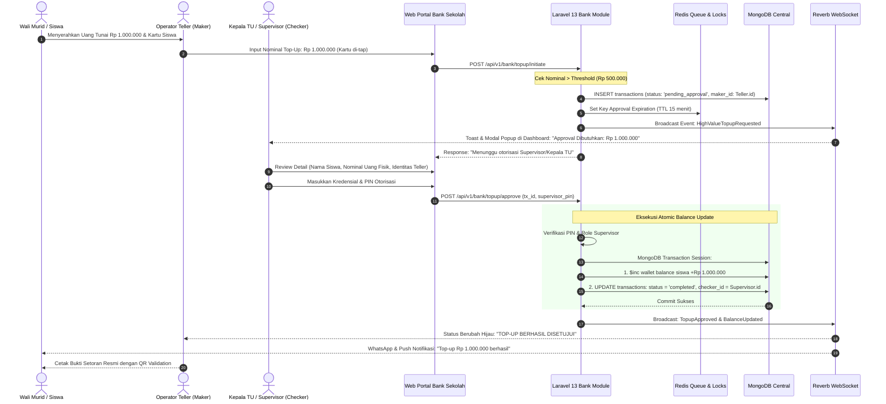

---

### 5.8 Alur Pembatalan & Refund Transaksi POS Kantin

Apabila kasir salah memasukkan nominal atau stok makanan habis setelah kartu di-tap, sistem melayani pembatalan instan secara transparan dengan prinsip **Immutable Reversal** (transaksi lama tidak pernah dihapus, melainkan dibuatkan transaksi pembalik bertipe `refund`):

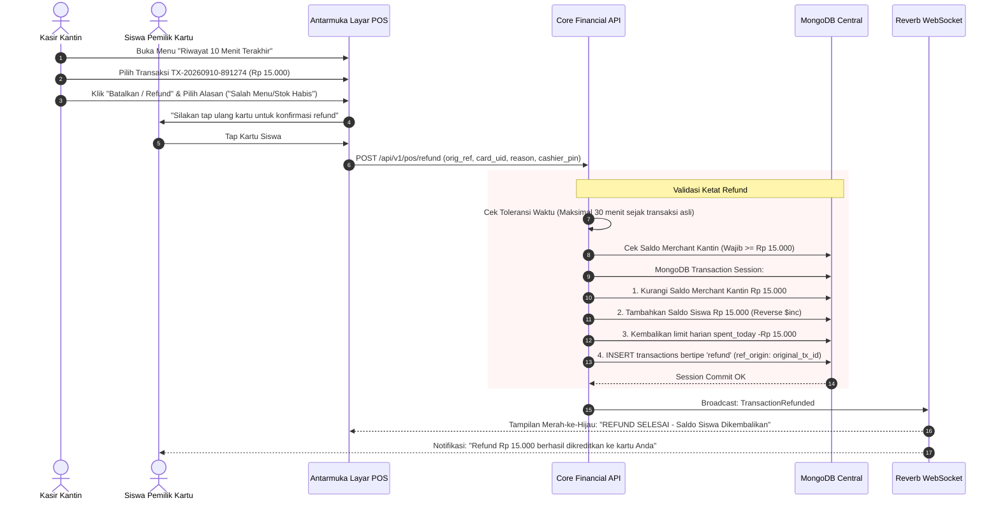

---

### 5.9 Alur Settlement Harian & Rekonsiliasi Otomatis (Zero-Fee Clearing)

Setiap hari kerja pukul 16:00 WIB (setelah jam operasional sekolah berakhir), sistem menjalankan prosedur *Day-End Closing* otomatis (`php artisan bank:settle`) untuk mencairkan hak merchant kantin/koperasi tanpa biaya admin (*Zero-Fee Policy*):

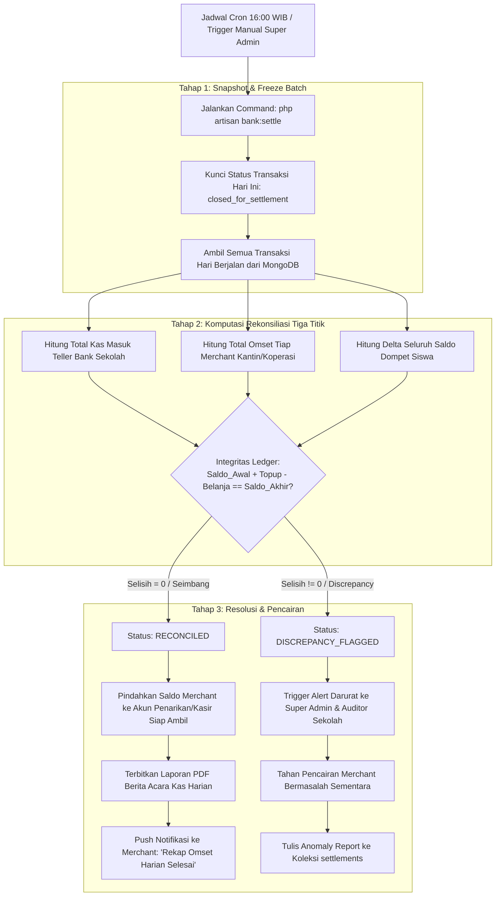

---

### 5.10 Alur Siklus Hidup Kartu RFID (Hilang, Freeze, & Penggantian Kartu)

Mengingat siswa rentan kehilangan kartu fisik, platform portal menjamin **keamanan 100% saldo digital** melalui arsitektur decoupled (saldo di database, bukan di fisik kartu):

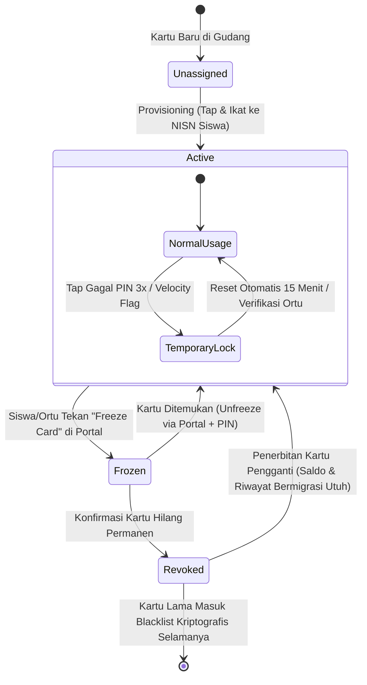

**Proses Penggantian Kartu Fisik Rusak/Hilang:**
1. Siswa/Wali melapor ke loket Bank Sekolah.
2. Operator memverifikasi data biometrik/wajah atau biodata orang tua.
3. Operator mengambil fisik kartu Mifare Ultralight C baru dan mengetapkannya ke RFID Desktop Reader.
4. Sistem mengeksekusi migrasi tautan:
   - Dokumen kartu lama diubah statusnya menjadi `status: "revoked"`, `revocation_reason: "reported_lost"`.
   - UID kartu lama di-broadcast ke Redis blacklist cache sehingga jika ada orang yang menemukan dan mencoba tap di kantin, reader langsung berbunyi peringatan (*stolen card alarm*).
   - Dokumen kartu baru diaktifkan dan ditautkan ke `user_id` yang sama.
   - **Saldo rupiah siswa tidak berkurang 1 sen pun** karena saldo tersimpan di dokumen `wallets`, bukan chip fisik.

---

### 5.11 Alur Kontrol Pengeluaran Orang Tua & Deteksi Anomali (Velocity Check)

Platform Portal memberikan ketenangan pikiran kepada orang tua murid melalui panel pengawasan pengeluaran anak:

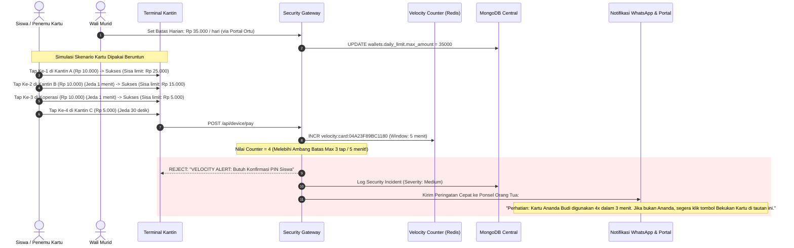

---

## 6. Spesifikasi Skema Document Database (MongoDB)

Berikut adalah definisi struktur koleksi (*collections*) utama pada Central Data Platform:

### 6.1 Koleksi `users` (Master Data Warga Sekolah)
Koleksi terpusat yang menyimpan identitas holistik siswa, guru, staf, maupun orang tua.

```json
{
  "_id": {"$oid": "66e01a8f90b1c2d3e4f50001"},
  "nisn": "0067812940",
  "nip": null,
  "username": "budi.santoso",
  "name": "Budi Santoso",
  "email": "budi.santoso@smkn9smg.sch.id",
  "role": "siswa",
  "academic": {
    "jurusan": "Rekayasa Perangkat Lunak",
    "kelas": "XII RPL 1",
    "tahun_masuk": 2024,
    "status": "aktif"
  },
  "contact": {
    "phone": "081234567890",
    "address": "Jl. Peterongan Sari No. 12, Semarang"
  },
  "guardian_ref": {
    "name": "Hadi Santoso",
    "relationship": "ayah",
    "phone": "081987654321",
    "portal_user_id": {"$oid": "66e01a8f90b1c2d3e4f50099"}
  },
  "rfid_binding": {
    "card_id": {"$oid": "66e01b1190b1c2d3e4f50002"},
    "card_uid": "04A23F89BC1180",
    "assigned_at": {"$date": "2024-07-15T07:00:00Z"}
  },
  "metadata": {
    "blood_type": "O",
    "is_thalassemia_donor": true,
    "total_donor_count": 3
  },
  "created_at": {"$date": "2024-07-10T02:30:00Z"},
  "updated_at": {"$date": "2026-09-10T06:00:00Z"}
}
```

*Index Rekomendasi*:
- `{"nisn": 1}` (Unique)
- `{"rfid_binding.card_uid": 1}` (Sparse, Unique)
- `{"role": 1, "academic.kelas": 1}`

---

### 6.2 Koleksi `wallets` (Buku Kas Saldo Digital)
Menyimpan saldo terkini dan aturan proteksi keuangan per akun.

```json
{
  "_id": {"$oid": "66e01b4490b1c2d3e4f50010"},
  "user_id": {"$oid": "66e01a8f90b1c2d3e4f50001"},
  "account_type": "student",
  "balance": 85000,
  "daily_limit": {
    "max_amount": 200000,
    "spent_today": 15000,
    "last_reset_date": "2026-09-10"
  },
  "status": "active",
  "security_flags": {
    "is_frozen": false,
    "freeze_reason": null,
    "frozen_at": null,
    "require_pin_above": 50000
  },
  "created_at": {"$date": "2024-07-15T07:05:00Z"},
  "updated_at": {"$date": "2026-09-10T09:45:00Z"}
}
```

---

### 6.3 Koleksi `transactions` (Immutable Financial Ledger)
Buku besar transaksi digital. Setiap transaksi yang sudah ditulis **tidak boleh diubah (UPDATE) atau dihapus (DELETE)**.

```json
{
  "_id": {"$oid": "66e0219990b1c2d3e4f50555"},
  "reference_no": "TX-20260910-891274",
  "type": "payment",
  "status": "completed",
  "amount": 15000,
  "source_wallet_id": {"$oid": "66e01b4490b1c2d3e4f50010"},
  "destination_merchant_id": "kantin-utara-01",
  "device_id": "device-pos-kantin-01",
  "security_verification": {
    "nonce": "e3b0c44298fc1c149afbf4c8996fb92427ae41e4649b934ca495991b7852b855",
    "signature": "hmac_sha256_verified",
    "timestamp": 1725961500
  },
  "cart_items": [
    {
      "product_id": {"$oid": "66e01c9090b1c2d3e4f50201"},
      "name": "Nasi Ayam Geprek",
      "qty": 1,
      "price": 15000
    }
  ],
  "balance_snapshot": {
    "before": 100000,
    "after": 85000
  },
  "created_at": {"$date": "2026-09-10T09:45:00Z"}
}
```

*Index Rekomendasi*:
- `{"reference_no": 1}` (Unique)
- `{"security_verification.nonce": 1}` (Unique)
- `{"source_wallet_id": 1, "created_at": -1}`
- `{"created_at": -1}`

---

### 6.4 Koleksi `products` (Marketplace Multijurusan dengan Polimorfisme)
Menampung produk dari berbagai jurusan dengan skema atribut fleksibel.

```json
{
  "_id": {"$oid": "66e01c9090b1c2d3e4f50201"},
  "title": "Trainer Kit IoT ESP32 MySkanilan v2",
  "slug": "trainer-kit-iot-esp32-myskanilan-v2",
  "category": "elektronika_iot",
  "creator_unit": {
    "jurusan": "Teknik Elektronika",
    "lead_student_id": {"$oid": "66e01a8f90b1c2d3e4f50001"},
    "supervisor_nip": "197802142005011002"
  },
  "pricing": {
    "price": 250000,
    "currency": "IDR",
    "allow_rfid_pay": true
  },
  "stock_inventory": {
    "available": 14,
    "reserved": 2,
    "warehouse_location": "Bengkel Elektronika 2"
  },
  "dynamic_attributes": {
    "voltage": "5V DC via Micro USB",
    "chipset": "ESP32-WROOM-32D",
    "included_sensors": ["DHT22", "Ultrasonic HC-SR04", "Relay 2-CH"],
    "firmware_version": "v1.4-build2026"
  },
  "gallery_images": [
    "https://storage.smkn9smg.sch.id/products/iot-kit-1.webp",
    "https://storage.smkn9smg.sch.id/products/iot-kit-schematic.webp"
  ],
  "status": "published",
  "created_at": {"$date": "2026-08-20T03:00:00Z"}
}
```

---

### 6.5 Koleksi `connected_apps` (Pendaftaran Aplikasi Baru & Eksternal)
Menyediakan kemampuan integrasi terbuka bagi aplikasi pihak ketiga atau platform buatan siswa di masa depan.

```json
{
  "_id": {"$oid": "66e0999990b1c2d3e4f50999"},
  "app_name": "Skanilan Mobile Parent Companion",
  "client_id": "app_client_parent_8812a",
  "hashed_secret": "$2y$12$e8p17b...",
  "developer_contact": "lab.rpl@smkn9smg.sch.id",
  "allowed_scopes": [
    "students:read_basic",
    "attendance:read_logs",
    "wallet:read_history"
  ],
  "webhook_endpoint": "https://mobile-gateway.smkn9smg.sch.id/webhooks/portal",
  "rate_limit_per_minute": 300,
  "status": "approved",
  "created_at": {"$date": "2026-09-01T00:00:00Z"}
}
```

---

### 6.6 Koleksi `rfid_cards` (Lifecycle Kartu Fisik & Enkripsi)
Menyimpan data fisik kartu RFID terpisah dari profil user untuk mempermudah manajemen siklus kartu (penggantian kartu hilang, audit kartu terblokir, enkripsi UID):

```json
{
  "_id": {"$oid": "66e01b1190b1c2d3e4f50002"},
  "card_uid": "04A23F89BC1180",
  "uid_hash": "e3b0c44298fc1c149afbf4c8996fb92427ae41e4649b934ca495991b7852b855",
  "card_type": "mifare_ultralight_c",
  "user_id": {"$oid": "66e01a8f90b1c2d3e4f50001"},
  "status": "active",
  "pin_security": {
    "has_pin": true,
    "hashed_pin": "$2y$12$K89eXq3...",
    "failed_attempts": 0,
    "locked_until": null
  },
  "lifecycle": {
    "issued_at": {"$date": "2024-07-15T07:00:00Z"},
    "issued_by_operator_id": {"$oid": "66e01a8f90b1c2d3e4f50888"},
    "freeze_history": [],
    "replaced_by_card_id": null,
    "revocation_reason": null
  },
  "created_at": {"$date": "2024-07-15T07:00:00Z"},
  "updated_at": {"$date": "2026-09-10T06:00:00Z"}
}
```

*Index Rekomendasi*:
- `{"card_uid": 1}` (Unique)
- `{"uid_hash": 1}` (Unique)
- `{"user_id": 1, "status": 1}`
- `{"status": 1}`

---

### 6.7 Koleksi `merchants` (Profil & Akun Penampung Kantin/Koperasi)
Menampung seluruh unit usaha internal sekolah dari 5 kategori merchant resmi:

```json
{
  "_id": {"$oid": "66e0333390b1c2d3e4f50777"},
  "code": "KNT-U01",
  "name": "Kantin Bu Nurul (Kantin Utara 1)",
  "type": "kantin_utara",
  "pic": {
    "name": "Nurul Hidayati",
    "phone": "081298765432",
    "nik": "3374025501800001"
  },
  "wallet_id": {"$oid": "66e01b4490b1c2d3e4f50999"},
  "clearing_policy": {
    "merchant_fee_percent": 0.0,
    "settlement_frequency": "daily_at_16_00",
    "bank_account": {
      "bank_name": "Bank Jateng",
      "account_number": "1002348910",
      "holder_name": "Nurul Hidayati"
    }
  },
  "authorized_devices": [
    "device-pos-kantin-01"
  ],
  "status": "active",
  "created_at": {"$date": "2024-07-01T00:00:00Z"}
}
```

*Index Rekomendasi*:
- `{"code": 1}` (Unique)
- `{"type": 1, "status": 1}`
- `{"wallet_id": 1}`

---

### 6.8 Koleksi `settlements` & `reconciliations` (Buku Tutup Harian & Audit Anomali)
Catatan batch closing harian otomatis untuk transparansi perputaran uang tunai & saldo non-tunai:

```json
{
  "_id": {"$oid": "66e0444490b1c2d3e4f50888"},
  "settlement_batch_id": "SETTLE-20260910-001",
  "batch_date": "2026-09-10",
  "cut_off_time": {"$date": "2026-09-10T16:00:00Z"},
  "summary": {
    "total_tx_count": 1420,
    "total_topup_nominal": 12500000,
    "total_spending_nominal": 9850000,
    "total_refund_nominal": 45000,
    "net_cleared_volume": 9805000
  },
  "reconciliation_audit": {
    "opening_system_balance": 45200000,
    "closing_system_balance": 47855000,
    "calculated_delta": 0,
    "integrity_status": "reconciled",
    "discrepancy_details": null
  },
  "merchants_payout": [
    {
      "merchant_id": {"$oid": "66e0333390b1c2d3e4f50777"},
      "code": "KNT-U01",
      "gross_amount": 1850000,
      "refund_deduction": 15000,
      "net_payout": 1835000,
      "disbursement_status": "ready_to_disburse"
    }
  ],
  "executed_by": "system_cron",
  "created_at": {"$date": "2026-09-10T16:00:05Z"}
}
```

*Index Rekomendasi*:
- `{"settlement_batch_id": 1}` (Unique)
- `{"batch_date": -1}`
- `{"reconciliation_audit.integrity_status": 1}`

---

## 7. Kontrak API Gateway & Protokol Integrasi

### 7.1 Standar Format Komunikasi

> **Sinkronisasi JSON:API (Laravel 13) & Custom Envelope**: README mendefinisikan API spec menggunakan standar **JSON:API (Laravel 13 native)**. Pada level gateway internal dan integrasi pihak ketiga, sistem mendukung negosiasi konten ganda (*Content Negotiation*):
> 1. Header `Accept: application/vnd.api+json` mengembalikan representasi standar resmi **JSON:API 1.1**.
> 2. Header `Accept: application/json` mengembalikan representasi ringkas **Custom Envelope** untuk konsumsi mudah oleh frontend React SPA dan perangkat IoT berdaya rendah (ESP32/Raspberry Pi).

**Tabel Komparasi Format Respon Gateway:**

| Field Data | Representasi Custom Envelope (`application/json`) | Representasi JSON:API (`application/vnd.api+json`) |
|---|---|---|
| Status Operasi | `"success": true` | Tersirat dari HTTP Status Code (200, 201) |
| Entitas Utama | `"data": { "id": "...", "name": "..." }` | `"data": { "type": "users", "id": "...", "attributes": { "name": "..." } }` |
| Relasi Entitas | `"data": { "wallet": { "balance": 50000 } }` | `"relationships": { "wallet": { "data": { "type": "wallets", "id": "..." } } }` |
| Metadata Server | `"meta": { "server_time": 1725962000, "version": "v1.0.0" }` | `"meta": { "server_time": 1725962000 }, "jsonapi": { "version": "1.1" }` |
| Penanganan Error | `"errors": [{ "code": "INSUFFICIENT_FUNDS", "message": "Saldo tidak cukup" }]` | `"errors": [{ "status": "422", "code": "E1002", "title": "Insufficient Funds", "detail": "Saldo tidak cukup" }]` |

Contoh respon standar portal (`application/json`):
```json
{
  "success": true,
  "data": {
    "user_id": "66e01a8f90b1c2d3e4f50001",
    "name": "Budi Santoso",
    "wallet": {
      "balance": 85000,
      "daily_spent": 15000,
      "daily_remaining": 185000
    }
  },
  "meta": {
    "server_time": 1725962000,
    "version": "v1.0.0"
  },
  "errors": null
}
```

### 7.2 Daftar Endpoint Kunci Portal

#### 1. Identitas & Siswa Terpadu
- `GET /api/v1/portal/me` — Ambil profil lengkap user login, status saldo, status kartu aktif, dan ringkasan presensi.
- `GET /api/v1/portal/students/{nisn}` — Detail komprehensif siswa termasuk histori akademik (Khusus Guru/Admin).
- `POST /api/v1/portal/students/provision` — Kaitkan fisik kartu RFID baru ke akun siswa yang terdaftar.

#### 2. Layanan Dompet & Bank Sekolah (Teller & Kontrol Kas)
- `GET /api/v1/bank/wallet/me` — Saldo riil, histori transaksi, limit harian, dan ringkasan mutasi.
- `POST /api/v1/bank/topup/initiate` — Teller menginput setoran tunai. Jika nominal $\le$ Rp 500.000 langsung diproses; jika nominal > Rp 500.000 masuk antrean `pending_approval`.
- `POST /api/v1/bank/topup/approve` — Supervisor/Kepala TU menyetujui setoran besar dengan verifikasi PIN (Dual-Control).
- `GET /api/v1/bank/topup/pending` — Daftar antrean top-up nominal besar yang membutuhkan otorisasi supervisor.
- `POST /api/v1/bank/cards/{card_id}/freeze` — Pembekuan darurat kartu (oleh Siswa, Orang Tua, atau Teller).
- `POST /api/v1/bank/cards/{card_id}/unfreeze` — Pembukaan blokir kartu setelah verifikasi PIN/kredensial.
- `POST /api/v1/bank/cards/{card_id}/replace` — Migrasi akun & saldo ke kartu fisik pengganti baru (kartu lama masuk blacklist permanen).

#### 3. Layanan POS Kasir Kantin & Refund
- `POST /api/device/pay` — Transaksi pembayaran belanja kantin/koperasi via tap reader RFID:
  - **Headers**:
    - `X-Device-ID`: Identifier perangkat kasir (contoh: `kantin-utara-01`)
    - `X-Device-Signature`: `HMAC-SHA256(device_secret, device_id + body_hash + timestamp)`
    - `X-Timestamp`: Unix epoch timestamp (toleransi $\pm 60$ detik)
  - **Payload**:
    ```json
    {
      "card_uid": "04A23F89BC1180",
      "amount": 15000,
      "nonce": "a3f9b2c1d8e4f6a7b0c3d5e8f1a4b7c0d2e5f8a1b4c7d0e3f6a9b2c5d8e1f4",
      "merchant_id": "kantin-utara-01",
      "items": [{"name": "Nasi Ayam", "qty": 1, "price": 15000}]
    }
    ```
- `POST /api/v1/pos/refund` — Pembatalan transaksi kasir (maksimal 30 menit, reversal balance otomatis, reason required).
- `GET /api/v1/pos/recent-sales` — 20 transaksi terakhir kasir hari ini untuk monitoring kasir.

#### 4. Presensi & Integrasi Perangkat IoT
- `POST /api/device/checkin` — Pemindaian tap presensi gerbang sekolah / pintu kelas.
- `GET /api/v1/portal/attendance/summary` — Statistik jam hadir siswa, persentase keterlambatan, dan log RFID.

#### 5. Pengawasan Orang Tua (Parent Companion)
- `GET /api/v1/portal/parent/children` — Daftar anak yang terhubung ke akun wali murid.
- `PUT /api/v1/portal/parent/children/{nisn}/daily-limit` — Orang tua mengatur batas belanja harian anak (Rp 20.000 s/d Rp 500.000).
- `GET /api/v1/portal/parent/children/{nisn}/timeline` — Feed riwayat presensi jam masuk/pulang serta log pengeluaran kantin realtime.

#### 6. Settlement & Rekonsiliasi Harian
- `POST /api/v1/bank/settle/run` — Memicu batch closing harian (`php artisan bank:settle`) secara manual atau via cron.
- `GET /api/v1/bank/settle/reports/{batch_id}` — Mengunduh berita acara rekonsiliasi kas tiga titik (PDF/JSON).

#### 7. Open API Gateway untuk Aplikasi Pihak Ketiga & Masa Depan
- `POST /api/v1/open/oauth/token` — Mendapatkan Bearer access token berdasarkan `client_id` & `client_secret`.
- `GET /api/v1/open/students/presence-today` — Mengambil data kehadiran massal hari ini (Scope: `attendance:read_logs`).
- `POST /api/v1/open/webhooks/subscribe` — Mendaftarkan URL callback webhook untuk event (`wallet.deducted`, `presence.recorded`, `donor.alert`).

---

## 8. Desain Arsitektur Antarmuka (Frontend Portal SPA)

### 8.1 Struktur Modul & Feature-Sliced Architecture

Frontend portal dibangun menggunakan **React 19 + Vite**, **TanStack Query v5**, **Tailwind CSS v3/v4**, dan **Shadcn UI**, diorganisasikan dengan pola *Feature-Sliced Design (FSD)* yang selaras 100% dengan modul backend:

```
frontend/src/
├── app/                           # Inisialisasi Aplikasi, Router, ThemeProvider (Dark/Light)
├── assets/                        # Logo SVG vektor, audio sound effects, web fonts
├── components/                    # UI Primitives & Global Layouts
│   ├── ui/                        # Shadcn/ui (Button, Dialog, Sheet, Table, Badge, Slider)
│   └── layout/                    # Navbar Portal, Dynamic Sidebar, Responsive Shell
├── features/                      # Domain Sub-sistem Mandiri
│   ├── auth/                      # Login SSO, OAuth Callback, Session & Token Storage
│   ├── portal-home/               # Landing Page Publik, News Feed, Showcase 7 Platform
│   ├── student-hub/               # Dashboard Siswa Terpadu (Kartu 3D, Saldo, Jadwal)
│   ├── parent-portal/             # Monitoring Wali Murid (Limit Slider, Feed Presensi)
│   ├── bank-teller/               # Antarmuka Teller Bank Sekolah & Approval Maker-Checker
│   ├── pos-cashier/               # Layar Kasir Kantin Layar Sentuh Berlatensi < 300ms
│   ├── cashless/                  # Manajemen Kartu RFID, Riwayat Transaksi, Freeze Card
│   ├── marketplace/               # Etalase Produk Kejuruan, Keranjang, Checkout Dompet
│   ├── lms/                       # Course Overview, Tugas, Pengumuman Kelas
│   ├── library/                   # Pencarian Buku Katalog OPAC & Status Peminjaman
│   ├── chatbot-widget/            # Floating RAG AI Assistant dengan Streaming Gemini
│   └── thalassemia/               # Info Golongan Darah Real-time & Jadwal Donor PMI
├── hooks/                         # useRfidReader (WebHID/Keyboard), useWebSocket, useAudioFeedback
├── services/                      # Axios HTTP Client dengan Request Interceptor (JWT Auto-Refresh)
└── store/                         # State Global Zustand (AuthStore, CartStore, NotificationStore)
```

---

### 8.2 Wireframe & Spesifikasi Layar Kunci Portal

#### Layar 1: Student Hub Dashboard (Layar Siswa)
Dirancang dengan konsep *Personal Academic & Financial Cockpit*:

```
┌────────────────────────────────────────────────────────────────────────────────────────┐
│ [LOGO] MySkanilan Portal         [Search...]       (🔔 3)  (Rp 85.000)  [Budi Santoso ▼]│
├────────────────────────────────────────────────────────────────────────────────────────┤
│ Halo, Budi Santoso (XII RPL 1)                                   Kamis, 10 Sep 2026   │
├──────────────────────────────────────┬─────────────────────────────────────────────────┤
│ ┌──────────────────────────────────┐ │ RINGKASAN STATUS HARI INI                       │
│ │   MYSKANILAN STUDENT CARD  [3D]  │ ├───────────────────────┬─────────────────────────┤
│ │                                  │ │ PRESENSI GERBANG      │ LIMIT BELANJA HARIAN    │
│ │   BUDI SANTOSO                   │ │ [● TEPAT WAKTU]       │ [==== 15k / 200k ===  ] │
│ │   NISN: 0067812940               │ │ Tap Masuk: 06.42 WIB  │ Sisa Kuota: Rp 185.000  │
│ │   RFID: 04:A2:3F:89:BC:11:80     │ ├───────────────────────┴─────────────────────────┤
│ │   STATUS: [● AKTIF]              │ │ PINTASAN CEPAT LAYANAN:                         │
│ │                                  │ │ [📚 2 Tugas LMS]      [📖 1 Pinjaman Perpus]   │
│ │   [🔒 BEKUKAN KARTU] [QR CODE]   │ │ [🛒 Skanilan Store]   [🩸 Donor Thalassemia]   │
│ └──────────────────────────────────┘ └─────────────────────────────────────────────────┘
├────────────────────────────────────────────────────────────────────────────────────────┤
│ 5 TRANSAKSI DOMPET TERAKHIR                                                            │
│ ┌───────────────────────┬──────────────┬──────────────┬──────────────┬───────────────┐ │
│ │ Waktu                 │ Merchant     │ Deskripsi    │ Nominal      │ Status        │ │
│ ├───────────────────────┼──────────────┼──────────────┼──────────────┼───────────────┤ │
│ │ 10 Sep 2026 09:45 WIB │ Kantin Utama │ Nasi Geprek  │ -Rp 15.000   │ [● SELESAI]   │ │
│ │ 09 Sep 2026 12:15 WIB │ Koperasi SMKN│ Buku Tulis   │ -Rp 8.000    │ [● SELESAI]   │ │
│ │ 08 Sep 2026 07:30 WIB │ Loket Bank   │ Setoran Kas  │ +Rp 100.000  │ [● SELESAI]   │ │
│ └───────────────────────┴──────────────┴──────────────┴──────────────┴───────────────┘ │
└────────────────────────────────────────────────────────────────────────────────────────┘
```

#### Layar 2: Kantin High-Speed Touchscreen POS (Layar Kasir)
Dioptimalkan untuk operasi tanpa mouse (*touch-only* atau numpad) saat antrean istirahat sekolah yang padat:

```
┌────────────────────────────────────────────────────────────────────────────────────────┐
│ KANTIN UTARA 01 — Kasir: Mbak Sri                  [Shift Pagi]  [🔴 OFFLINE / 🟢 ONLINE]│
├────────────────────────┬───────────────────────────────────────────┬───────────────────┤
│ KATEGORI MENU          │ KATALOG PRODUK CEPAT                      │ TIKET BELANJA     │
│ ┌────────────────────┐ │ ┌───────────────┐ ┌───────────────┐       │ No: #ORD-0891     │
│ │ [★ Paling Laris]   │ │ │ Nasi Ayam     │ │ Es Teh Manis  │       │ ───────────────── │
│ │ [🍱 Makanan Berat] │ │ │ Geprek        │ │ Jumbo         │       │ 1x Nasi Ayam 15k  │
│ │ [🥪 Snack/Camilan] │ │ │ Rp 15.000     │ │ Rp 4.000      │       │ 1x Es Teh     4k  │
│ │ [🥤 Minuman Dingin]│ │ │ [Stok: 24]    │ │ [Stok: 50]    │       │ ───────────────── │
│ │ [📑 Riwayat & Void]│ │ └───────────────┘ └───────────────┘       │ TOTAL:  Rp 19.000 │
│ └────────────────────┘ │ ┌───────────────┐ ┌───────────────┐       ├───────────────────┤
│                        │ │ Roti Bakar    │ │ Air Mineral   │       │ STATUS PEMBAYARAN │
│ [BATALKAN / VOID]      │ │ Cokelat       │ │ 600ml         │       │                   │
│ [REFUND TX SEBELUMNYA] │ │ Rp 8.000      │ │ Rp 3.000      │       │ ┌───────────────┐ │
│                        │ └───────────────┘ └───────────────┘       │ │  TAP KARTU    │ │
│                        │                                           │ │  RFID SISWA   │ │
│                        │                                           │ │   (( 📡 ))    │ │
│                        │                                           │ └───────────────┘ │
│                        │                                           │ [BAYAR TUNAI/ALT] │
└────────────────────────┴───────────────────────────────────────────┴───────────────────┘
```

#### Layar 3: Bank Sekolah Teller Counter (Layar Operator Keuangan)
Menangani setoran tunai dengan deteksi hardware reader otomatis dan panel otorisasi supervisor:

```
┌────────────────────────────────────────────────────────────────────────────────────────┐
│ BANK SEKOLAH SMKN 9 — Loket 02 (Operator: Siti Aminah)             [Antrean: 4 Menunggu]│
├─────────────────────────────────────────────────┬──────────────────────────────────────┤
│ FORM SETORAN TUNAI (TOP-UP WALLET)              │ SENSOR RFID DESKTOP: [🟢 TERHUBUNG]  │
├─────────────────────────────────────────────────┴──────────────────────────────────────┤
│ 1. Data Siswa:                                                                         │
│    NISN / Nama: [ 0067812940         ] -> Terdeteksi: BUDI SANTOSO (XII RPL 1)        │
│    UID Kartu Fisik: [ 04:A2:3F:89:BC:11:80 (Terbaca Otomatis via USB HID Reader)    ]  │
│    Saldo Terkini: Rp 85.000                                                            │
│                                                                                        │
│ 2. Detail Setoran:                                                                     │
│    Nominal Setor: Rp [ 1.000.000                          ]                            │
│    Terbilang: Satu Juta Rupiah                                                         │
│                                                                                        │
│    [!] PERINGATAN DUAL-CONTROL:                                                        │
│    Nominal > Rp 500.000 memerlukan persetujuan Supervisor/Kepala TU.                   │
│                                                                                        │
│    [ PROSES & MINTA APPROVAL SUPERVISOR ]          [ RESET / BATAL ]                  │
├────────────────────────────────────────────────────────────────────────────────────────┤
│ DAFTAR PERMINTAAN BUTUH OTORISASI (DRAWER SUPERVISOR):                                 │
│ • TX-9011: Top-Up Rp 1.000.000 (Siswa: Budi Santoso) - Maker: Loket 02 [APPROVE / PIN] │
│ • TX-9008: Cetak Kartu Baru (Siswa: Ahmad Fauzi) - Kartu Lama Hilang    [SETUJUI]      │
└────────────────────────────────────────────────────────────────────────────────────────┘
```

#### Layar 4: Parent Companion View (Layar Wali Murid)
Memberikan kendali penuh dan rasa aman bagi orang tua murid secara real-time:

```
┌────────────────────────────────────────────────────────────────────────────────────────┐
│ PORTAL ORANG TUA — Akun: Hadi Santoso                                 [📞 Bantuan TU]  │
├────────────────────────────────────────────────────────────────────────────────────────┤
│ Pilih Ananda: [ Budi Santoso (XII RPL 1) ▼ ]                                          │
├──────────────────────────────────────┬─────────────────────────────────────────────────┤
│ STATUS KEAMANAN KARTU ANANDA         │ KONTROL PENGELUARAN HARIAN                      │
│ ┌──────────────────────────────────┐ │ Plafon Pengeluaran: [ Rp 35.000 / Hari       ] │
│ │ Status: [🟢 NORMAL / AKTIF]      │ │ Slider: [-----●-------------------------]       │
│ │ Kartu UID: 04:A2:3F:89:BC:11:80  │ │ Min Rp 20k                      Max Rp 500k     │
│ │                                  │ │ Pengeluaran Hari Ini: Rp 15.000                 │
│ │ [🚨 BEKUKAN KARTU SEKARANG]      │ │ Sisa Plafon Tersedia: Rp 20.000                 │
│ └──────────────────────────────────┘ │ [ SIMPAN PERUBAHAN LIMIT ]                      │
├──────────────────────────────────────┴─────────────────────────────────────────────────┤
│ LIVE TIMELINE AKTIVITAS ANANDA HARI INI (10 September 2026)                            │
│ • 06:42 WIB — [🟢 PRESENSI] Tap Masuk Gerbang Utama (Tepat Waktu)                      │
│ • 07:05 WIB — [📚 LMS] Guru mengunggah materi 'Pemrograman Perangkat Bergerak'         │
│ • 09:45 WIB — [💳 JAJAN KANTIN] Pembelian di Kantin Mbak Sri (Rp 15.000)               │
│ • 12:30 WIB — [📖 PERPUS] Mengembalikan Buku 'Algoritma Pemrograman'                   │
└────────────────────────────────────────────────────────────────────────────────────────┘
```

#### Layar 5: Portal Public Showcase & Single Gate
Halaman muka publik berestetika tinggi yang merepresentasikan citra digital SMKN 9 Semarang:

```
┌────────────────────────────────────────────────────────────────────────────────────────┐
│ [SMKN 9 SEMARANG]     Beranda   Katalog Produk   LMS   Donor Darah   Perpus   [MASUK]  │
├────────────────────────────────────────────────────────────────────────────────────────┤
│                                                                                        │
│     MYSKANILAN INTEGRATED ECOSYSTEM                                                    │
│     Satu Kartu Pintar, Satu Gerbang Digital,                                           │
│     Membangun Kemandirian Warga Sekolah.                                               │
│                                                                                        │
│     [ JELAJAHI KATALOG PRODUK SISWA ]        [ CEK STATUS DARAH THALASSEMIA ]          │
│                                                                                        │
├────────────────────────────────────────────────────────────────────────────────────────┤
│ DENYUT EKONOMI SIRKULAR & PRESTASI SEKOLAH REAL-TIME:                                  │
│ [ Rp 48.250.000 Transaksi Non-Tunai ]  [ 1.450 Siswa Terkoneksi ]  [ 128 Kantong Darah ]│
├────────────────────────────────────────────────────────────────────────────────────────┤
│ 7 PILAR LAYANAN DIGITAL TERPADU:                                                       │
│ ┌───────────────┐ ┌───────────────┐ ┌───────────────┐ ┌───────────────┐               │
│ │ Bank Sekolah  │ │ Skanilan POS  │ │ Marketplace   │ │ ThalassemiaGo │               │
│ │ Tabungan &    │ │ Tap Cashless  │ │ Produk Karya  │ │ Donor Darah & │               │
│ │ Kartu Terpadu │ │ Anti-Antre    │ │ 5 Kejuruan    │ │ RS Kariadi    │               │
│ └───────────────┘ └───────────────┘ └───────────────┘ └───────────────┘               │
└────────────────────────────────────────────────────────────────────────────────────────┘
```

---

### 8.3 Design Tokens, Palet Warna & Audio-Visual Sensory Feedback

Untuk menjamin antarmuka terlihat modern, berwibawa, dan memenangkan kompetisi JHIC:

#### Palet Warna & Tokens (Tailwind CSS Extended):
- **Background Utama (Dark Surface)**: `#0B0F17` (Deep Obsidian Slate) — menghadirkan kesan profesional dan mengurangi kelelahan mata.
- **Card Surface & Border**: `#1E293B` (Slate-800) dengan border `#334155` (Slate-700).
- **Aksen Primer (Cyber Cyan)**: `#06B6D4` (Cyan-500) — digunakan pada status aktif, tombol utama, dan indikator RFID.
- **Aksen Sukses & Keuangan (Emerald Green)**: `#10B981` (Emerald-500) — transaksi berhasil, saldo bertambah, kehadiran tepat waktu.
- **Aksen Peringatan (Amber Gold)**: `#F59E0B` (Amber-500) — limit belanja menipis, butuh approval supervisor.
- **Aksen Bahaya & Proteksi (Crimson Rose)**: `#F43F5E` (Rose-500) — kartu dibekukan, saldo tidak cukup, pelanggaran keamanan.

#### Audio Sensory Feedback (Web Audio API Synthesizer):
Sistem tidak mengandalkan file audio MP3 eksternal yang lambat di-load, melainkan membangkitkan nada sintetis native di browser:
1. **Beep Transaksi Sukses**: Dual Sinewave Chime (frekuensi 880 Hz disusul 1760 Hz, durasi 120 ms) — memberi kepastian instan pada kasir dan pembeli.
2. **Buzzer Saldo Kurang / Ditolak**: Sawtooth wave (frekuensi 220 Hz, durasi 350 ms, amplitude decay tajam).
3. **Chime Notifikasi Approval**: Harmoni C-Major chord (523 Hz + 659 Hz + 784 Hz, durasi 200 ms).

#### Micro-Interactions & Hardware Sync:
- **Pulsing NFC Target**: Ring animasi berdenyut (*CSS radar pulse*) pada area tap reader kasir yang menyala biru ketika siap menerima tap, dan berubah hijau neon saat pembacaan UID berhasil.
- **Card Flip 3D**: Animasi interaktif kartu pelajar virtual menggunakan CSS 3D Transforms (`perspective: 1000px`, `transform: rotateY(180deg)`) untuk memperlihatkan barcode darurat di sisi belakang.

---

## 9. Protokol Keamanan, Validasi & Audit Trail

Sistem menerapkan prinsip **Zero-Trust pada Perangkat Keras** dan **Strict Financial Integrity**:

```
                              ┌───────────────────────────┐
                              │     REQUEST DARI DEVICE   │
                              └─────────────┬─────────────┘
                                            │
               [Layer 1: Network] ──► Validasi IP & TLS 1.3
                                            │
           [Layer 2: Cryptographic] ──► Cek HMAC-SHA256 Signature
                                            │
             [Layer 3: Anti-Replay] ──► Cek Nonce & Jendela Waktu (Redis)
                                            │
              [Layer 4: Validation] ──► FormRequest Strict Typing
                                            │
               [Layer 5: Financial] ──► Atomic Transaction & Row Lock
                                            │
                   [Layer 6: Audit] ──► Immutable Activity Log
```

### 9.1 Standar Hardware RFID & Klarifikasi UID 7-Byte

Untuk menjamin kehandalan implementasi fisik kartu pintar siswa:
1. **Spesifikasi Chip Kartu**: NXP Mifare Ultralight C (ISO/IEC 14443-3 Type A, frekuensi 13.56 MHz).
2. **Klarifikasi Panjang UID**:
   - Chip Mifare Ultralight C memiliki **7-byte Unique Identifier (UID)** yang diatur permanen sejak pabrik (*factory-set read-only*).
   - Format heksadesimal terdiri dari **14 karakter hex** (contoh: `04:A2:3F:89:BC:11:80` atau string tanpa separator `04A23F89BC1180`), di mana byte awal `04` merepresentasikan kode produsen NXP Semiconductors.
   - *Catatan Koreksi*: Istilah "8 hex bytes" yang sempat tercantum pada catatan awal arsitektur adalah *misnomer teknis*. Standar resmi yang digunakan pada seluruh API dan database portal adalah **7 bytes (14 hex chars)**.
3. **Perangkat Pembaca (Reader)**:
   - **Loket Teller TU**: Desktop Reader USB ACR122U / RC522 dengan mode USB HID Emulation untuk input instan tanpa driver rumit.
   - **Terminal Kantin & Gerbang Presensi**: Mikrokontroler ESP32-WROOM-32 terhubung modul RFID RC522/PN532 via SPI Bus, dilengkapi layar LCD I2C 16x2 atau TFT ST7789 dan modul buzzer audio.

---

### 9.2 Kebijakan Kriptografi & Siklus Hidup Token OAuth2

Keamanan data kredensial dan sesi portal diatur dengan standar perbankan modern:

#### 1. Password & PIN Hashing
- Seluruh password akun portal di-hash menggunakan algoritma **Bcrypt dengan Cost Factor 12** (`$2y$12$...`).
- PIN transaksi 6-digit (opsional untuk transaksi bernominal besar) di-hash menggunakan salt unik per-user sebelum disimpan ke dokumen `rfid_cards.pin_security.hashed_pin`.

#### 2. Siklus Hidup Token OAuth2 (Laravel Passport)
Sistem memisahkan akses jangka pendek dan kredensial jangka panjang:
- **Access Token (15 Menit)**: Bertipe stateless JWT yang membawa klaim `user_id`, `role`, dan `scopes`. Masa berlaku singkat (15 menit) memitigasi risiko jika token tercegat di jaringan publik.
- **Refresh Token (7 Hari)**: Disimpan terenkripsi di database dan Redis. Digunakan untuk memperbarui access token di latar belakang (*silent refresh*) tanpa memaksa user login ulang.
- **Auto-Rotation Refresh Token**: Setiap kali refresh token dipakai, token tersebut langsung dihanguskan (*single-use revocation*) dan digantikan pasangan token yang baru.
- **Revocation List Cepat di Redis**: Saat pengguna menekan tombol *Logout* atau *Bekukan Kartu (Freeze)*, `jti` (JWT ID) token langsung didaftarkan ke Redis Blacklist Set dengan TTL sesuai sisa masa berlaku token, membatalkan otorisasi seketika di seluruh gateway.

---

### 9.3 Mesin Deteksi Kecurangan (Velocity Check & Device Integrity)

Untuk menangkal skenario kartu terjatuh, pencurian fisik, atau *brute-force transaction*:

1. **Algoritma Sliding Window Velocity Counter (Redis)**:
   - Setiap transaksi kartu di kantin mengeksekusi operasi atomik di Redis:
     ```bash
     MULTI
     INCR velocity:card:04A23F89BC1180
     EXPIRE velocity:card:04A23F89BC1180 300
     EXEC
     ```
   - **Aturan 1 (Batas Frekuensi)**: Maksimal 3 transaksi sukses dalam jendela waktu geser 5 menit (*sliding window*). Transaksi ke-4 dalam rentang tersebut otomatis ditahan (*flagged*) dan mewajibkan input PIN 6-digit siswa di layar POS.
   - **Aturan 2 (Ambang Batas Nominal PIN)**: Setiap pembelian tunggal di atas Rp 50.000 (`require_pin_above`) otomatis meminta PIN otorisasi.
   - **Aturan 3 (Toleransi Waktu & Jam Device)**: API Gateway mencocokkan `X-Timestamp` dari perangkat reader dengan jam server NTP SMKN 9 (`ntp.smkn9smg.sch.id`). Jika selisih waktu melebihi $\pm 60$ detik, request ditolak seketika (*Clock Drift Rejection*).
2. **Zero-Balance Guarantee**:
   - Kartu RFID fisik **TIDAK menyimpan saldo**. Mengkloning nomor UID ke kartu lain (*card cloning/spoofing*) tidak akan menggandakan uang karena saldo, histori belanja, dan kunci enkripsi 100% berada di server terpusat.
3. **Audit Trail Komprehensif**:
   - Setiap mutasi saldo, perubahan limit orang tua, atau otorisasi supervisor dicatat ke dalam log mutasi yang merekam: IP Address, User-Agent, Session ID, Geo/Device location, serta snapshot saldo sebelum (*before*) dan sesudah (*after*). Data audit berstatus *append-only* (tidak dapat diubah atau dihapus).

---

### 9.4 Kepatuhan Regulasi Nasional & Landasan Yuridis

Sistem MySkanilan dirancang dengan kepatuhan hukum yang ketat (*regulatory compliance by design*) terhadap 4 pilar perundang-undangan di Indonesia:

#### 1. Regulasi Sistem Pembayaran & Pengecualian Izin PJP (Bank Indonesia)
- **Dasar Hukum**: Peraturan Bank Indonesia (PBI) No. 22/23/PBI/2020 tentang Sistem Pembayaran jo. PBI No. 23/6/PBI/2021 tentang Penyelenggara Jasa Pembayaran (PJP) & PBI No. 20/6/PBI/2018 tentang Uang Elektronik.
- **Kepatuhan & Batasan**:
  1. *Closed-Loop Ecosystem*: Instrumen saldo MySkanilan hanya berlaku terbatas di dalam ekosistem internal SMKN 9 Semarang (kantin, koperasi, perpustakaan, marketplace kejuruan) dan tidak dapat ditarik tunai sembarangan di luar sekolah.
  2. *Ambang Batas Dana Float*: Ketentuan BI menetapkan kewajiban izin PJP bagi instrumen uang elektronik jika jumlah **Dana Mengendap (*Floating Fund*) mencapai atau melebihi Rp 1.000.000.000 (Satu Miliar Rupiah)**. Perputaran uang saku 1.500 siswa SMKN 9 Semarang berada pada kisaran Rp 30.000.000 – Rp 75.000.000 per hari, sehingga secara hukum **sah beroperasi dan dikecualikan dari kewajiban perizinan PJP komersial**.

#### 2. Kepatuhan UU Pelindungan Data Pribadi (UU PDP No. 27 Tahun 2022)
- **Status Penegakan**: Berlaku penuh secara efektif sejak **17 Oktober 2024** dengan ancaman sanksi denda administratif hingga 2% dari pendapatan serta sanksi pidana (Pasal 57 & Pasal 67–73).
- **Penanganan Data Pribadi Spesifik (Pasal 4 ayat 2)**:
  - *Data Anak*: Siswa mayoritas berusia di bawah 18 tahun. Sesuai **Pasal 25 UU PDP**, pemrosesan data anak wajib memperoleh persetujuan eksplisit orang tua/wali (*Parental Consent*). Diimplementasikan melalui penautan akun siswa ke Portal Orang Tua (*Parent Companion*).
  - *Data Kesehatan (Thalassemia)*: Hasil skrining golongan darah dan catatan donor darah diisolasi dengan kontrol akses role medis khusus dan enkripsi dokumen.
  - *Data Keuangan Pribadi*: Mutasi dan saldo dilindungi arsitektur *Zero-Balance on Card* (kartu fisik tidak menyimpan data uang/identitas pribadi selain nomor seri acak UID).

#### 3. Fleksibilitas Pengelolaan Keuangan BLUD SMK & Teaching Factory
- **Dasar Hukum**: Permendagri No. 79 Tahun 2018 tentang Badan Layanan Umum Daerah (BLUD) jo. Permendikbudristek No. 40 Tahun 2021 tentang Penyelenggaraan Teaching Factory (TeFa).
- **Legitimasi Kas Sekolah**: SMK Negeri dengan status BLUD / Teaching Factory memiliki otonomi fleksibilitas untuk mengelola pendapatan unit produksi, jasa kantin, dan perputaran kas bank sekolah secara mandiri untuk operasional pendidikan tanpa kewajiban birokrasi penyetoran ke kas umum daerah.

#### 4. Keabsahan Bukti Transaksi Elektronik (UU ITE)
- **Dasar Hukum**: UU No. 1 Tahun 2024 jo. UU No. 11 Tahun 2008 Pasal 5 & 6.
- Setiap transaksi pembayaran tap atau top-up menghasilkan struk elektronik dengan ID referensi unik, hash integritas HMAC-SHA256, dan catatan stempel waktu (*immutable ledger*), yang memiliki kekuatan pembuktian hukum sah dalam audit keuangan sekolah.

---

## 10. Rencana Implementasi & Prototype Roadmap

Untuk mewujudkan konsep ini menjadi prototipe yang siap ditunjukkan dalam lomba JHIC:

### Tahap 1: Setup Master Data & Database Engine (Minggu 1)
- Inisialisasi backend Laravel 13 dan frontend React 19.
- Konfigurasi driver MongoDB menggunakan `mongodb/laravel-mongodb`.
- Buat migration dan seed data awal (100 profil siswa, 5 gerai kantin, 20 produk kejuruan).
- Setup Redis untuk caching dan antrean.

### Tahap 2: Implementasi Core Portal & Bank Sekolah (Minggu 2)
- Bangun alur autentikasi OAuth2 / SSO untuk portal.
- Implementasikan endpoint teller Bank Sekolah untuk topup saldo dan freeze kartu.
- Buat emulator perangkat RFID sederhana via web socket/terminal untuk menguji tap pembayaran.

### Tahap 3: Marketplace & LMS Bridging (Minggu 3)
- Bangun modul etalase marketplace dengan skema produk dinamis di MongoDB.
- Integrasikan checkout belanja langsung memotong saldo digital siswa.
- Hubungkan presensi RFID dengan tampilan status siswa di modul LMS.

### Tahap 4: AI Chatbot RAG & Open API Gateway (Minggu 4)
- Integrasikan Laravel AI SDK dengan Google Gemini 2.0 Flash untuk membaca data koleksi MongoDB.
- Sediakan dokumentasi Swagger/OpenAPI untuk demonstrasi kepada juri tentang bagaimana aplikasi luar dapat berintegrasi.
- Uji beban (*stress-test*) transaksi paralel saat simulasi jam istirahat sekolah.

---

> **Status Dokumen**: *Living Design Document — Disiapkan sebagai rujukan blueprint resmi arsitektur sistem MySkanilan Portal SMKN 9 Semarang.*
